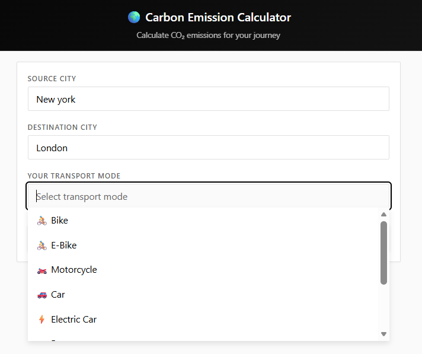
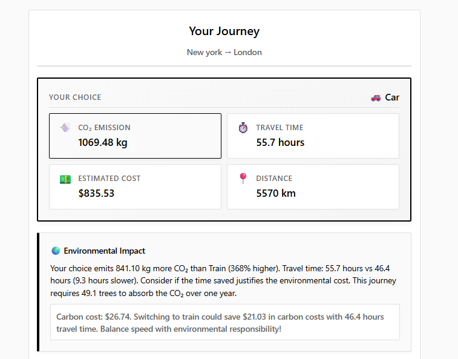
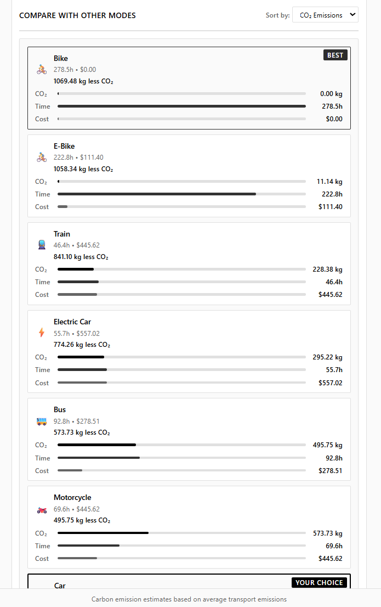
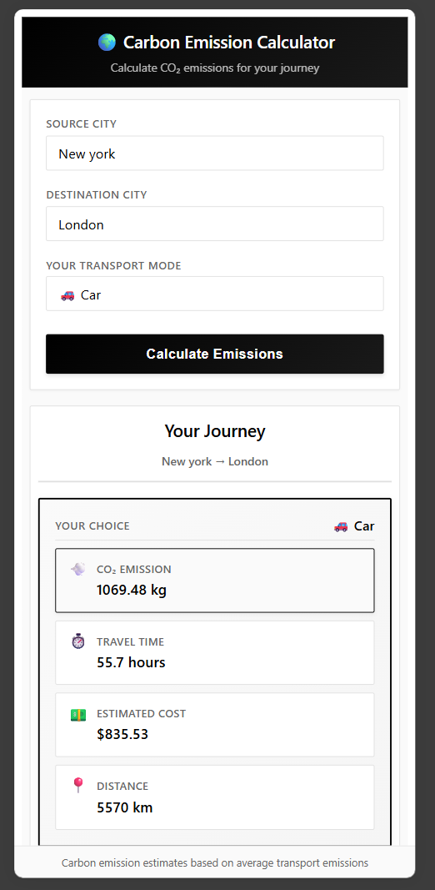

# 🌍 Carbon Emission Calculator

A web application to calculate and compare CO₂ emissions across different transport modes.

## Objective

Help users make environmentally conscious travel decisions by visualizing carbon footprints, travel time, and costs for journeys between major cities.

## Features

- Calculate emissions for 20+ cities worldwide
- Compare 9 transport modes (bike, e-bike, motorcycle, car, electric car, bus, train, truck, airplane)
- Real-time impact analysis with carbon pricing
- Autocomplete city and transport selection
- Responsive design

## Technologies

**Frontend**
- HTML5
- CSS3 (Custom properties, Grid, Flexbox)
- Vanilla JavaScript (ES6+)

**Architecture**
- Modular JavaScript organization
- Separation of concerns (data, logic, UI, app)
- No dependencies or frameworks

## Structure

```
├── src/
│   ├── index.html          # Main HTML file
│   ├── favicon.svg         # Site favicon
│   ├── css/
│   │   └── styles.css      # Styling
│   └── js/
│       ├── routes-data.js  # City and transport data
│       ├── calculator.js   # Distance and emission calculations
│       ├── ui.js           # UI rendering and formatting
│       ├── config.js       # DOM references
│       └── app.js          # Event handlers and logic
├── .github/
│   └── workflows/
│       └── deploy.yml      # GitHub Pages deployment
├── screenshots/            # Application screenshots
└── README.md
```

## Screenshots

### Main Interface


*Clean form with autocomplete for cities and transport modes*

### Results & Comparison


*Detailed emission breakdown with environmental impact analysis*

### Mode Comparison


*Side-by-side comparison of all transport options with visual bars*

### Mobile View


*Fully responsive design for mobile devices*

## Usage

Open `src/index.html` in a modern web browser. No build process required.

## Deployment

The project is configured for automatic deployment to GitHub Pages:
- Push to `main` branch triggers the deployment workflow
- View the workflow in `.github/workflows/deploy.yml`
- Access your deployed site at `https://<username>.github.io/<repository-name>/`

## Calculations

- **Distance**: Haversine formula
- **Emissions**: kg CO₂ per km by mode
- **Carbon pricing**: $25 per ton
- **Tree absorption**: 21.77 kg CO₂ per year